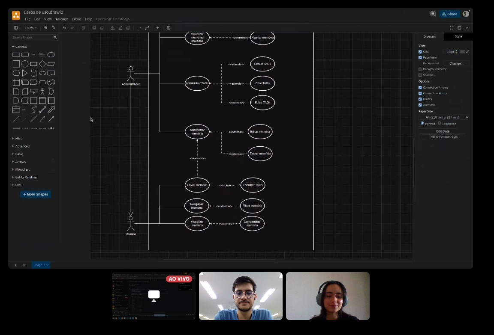

# Reunião 09/05/2025

Início: 16:00 | Fim: 17:00

## Participantes Convocados

Na Tabela 1, são apresentados os participantes da reunião, juntamente com os indicadores que demonstram se estavam presentes ou não, onde :white_check_mark: significa que o participante estava presente e :x: significa que o participante não compareceu à reunião.

Tabela 1: Participantes Convocados e Presença na Reunião

<table align="center">
  <tr>
    <th>Nome</th><th>Matrícula</th><th>Presente</th>
  </tr>
  <tr><td>Cairo Florenço Santos</td><td>222014975</td><td>:x:</td></tr>
  <tr><td>Edilson Ribeiro da Cruz Júnior</td><td>222024461</td><td>:x:</td></tr>
  <tr><td>Maria Eduarda Vieira Monteiro</td><td>221008356</td><td>:x:</td></tr>
  <tr><td>Gabriel Reis Scheidt Paulino</td><td>222015112</td><td>:x:</td></tr>
  <tr><td>Gustavo Feitosa Haubert</td><td>222024793</td><td>:x:</td></tr>
  <tr><td>Manuella Magalhães Valadares</td><td>22/1022720</td><td>:white_check_mark:</td></tr>
  <tr><td>Marcos Vieira Marinho</td><td>222021906</td><td>:white_check_mark:</td></tr>
  <tr><td>Marcus Vinícius Figuerêdo Escobar</td><td>222006973</td><td>:x:</td></tr>
  <tr><td>Mateus Henrique Queiroz Magalhães Sousa</td><td>222025950</td><td>:x:</td></tr>
  <tr><td>Pedro Gois Marques Monteiro</td><td>222026386</td><td>:x:</td></tr>
  <tr><td>William Bernardo da Silva</td><td>222021933</td><td>:x:</td></tr>
</table>

Autor: [Manuella](https://github.com/manuvaladares)

## Pautas

- Criar uma especificação de caso de uso para `enviar memória`
- "Será que não tem um extend de enviar memória para adicionar memória?"
- Revisão do diagrama

## Decisões

- Percebemos durante a especificação que "Adicionar memória" do ator Administrador possuia um extends para "enviar memória".
- A especificação de Caso de uso foi finalizado sem mais problemas.

## Durante o trabalho:

## Histórico de versões

| Versão | Data       | Descrição                             | Autor(es)       | Revisor(es)    | Comentário do Revisor |
| ------ | ---------- | ------------------------------------- | --------------- | -------------- | --------------------- |
| 1.0    | 09/05/2025 | Adição da ata de reunião da entrega 2 | [Manuella](https://github.com/manuvaladares)  | Marcos | Nessa reunião conseguimos compreender melhor nosso projeto, Excelente!                     |
