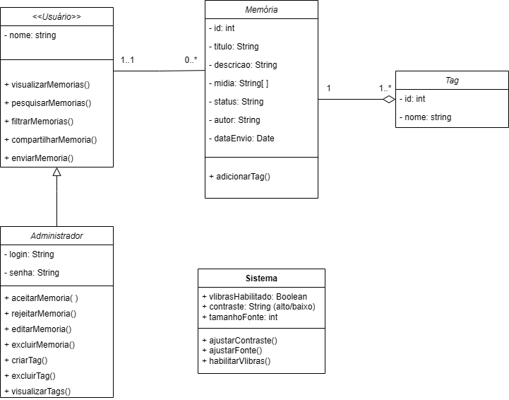

## 2.1.1. Diagrama de Classes

Os diagramas de classes são um dos seis tipos de diagramas estruturais em Unified Modeling Language(UML). Os diagramas de classe são fundamentais para o processo de modelagem de objetos e modelam a estrutura estática de um sistema, eles podem ser utilizados para modelar os objetos que compõem o sistema, a fim de representar os relacionamentos entre os objetos e representar o que fazem e os serviços que são fornecidos. 

A figura a seguir é uma representação do site EternaFGA em um diagrama de classes. Esse diagrama mostra como uma classe que representa o administrador se relaciona com a classe abstrata de usuário, a qual se relaciona com classes que representam as memórias dos usuários e uma classe que representa as tags presentes nas memórias e, por fim, uma classe que representa o sistema e suas opções de acessibilidade.  

## Diagrama de Classes

## 

## Referências Bibliográficas

IBM CORPORATION. Diagramas de Classes em Modelagem UML. In: IBM Knowledge Center – Rational Software Modeler, v. 7.5.0. Disponível em: https://www.ibm.com/docs/pt-br/rsm/7.5.0?topic=structure-class-diagrams. Acesso em: 07 maio 2025.

| Versão | Data | Descrição | Autor(es) | Revisor(es) | Comentário do Revisor |
| :-: | :-: | :-: | :-: | :-: | :-: |
| `1.0` | 07/05/2025  | Adiciona descrição ao diagrama de classes | Gustavo Feitosa | | |