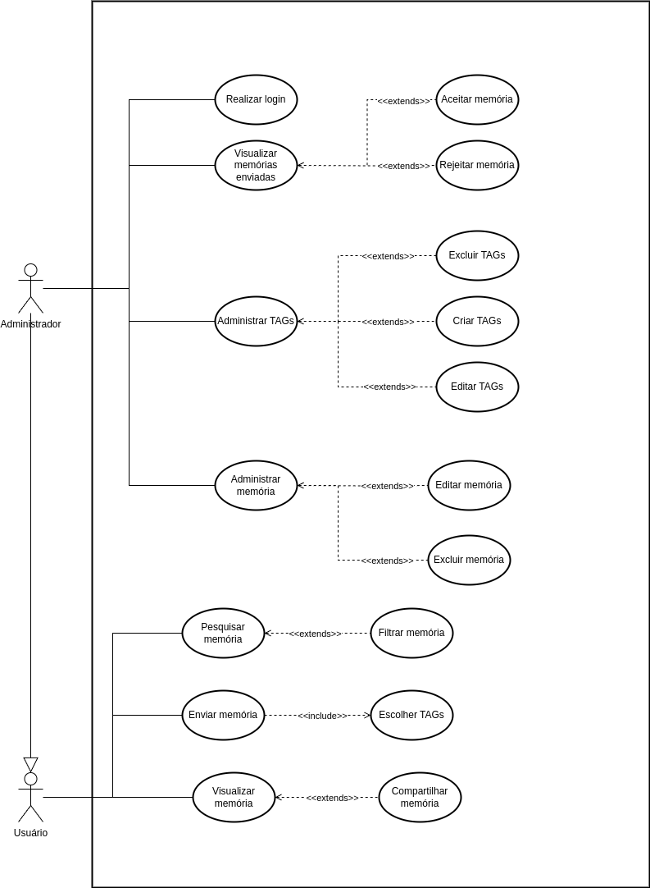

# 2.3. Módulo Notação UML – Casos de Uso

Foco_3: Modelagem Organizacional OU Casos de Uso.

>Entrega Mínima: 1 Modelo, sendo esse o Diagrama de Pacotes ou o Diagrama de Casos de Uso.
>
>Apresentação (para a professora) explicando o modelo especificado, com: (i) rastro claro aos membros participantes (MOSTRAR QUADRO DE PARTICIPAÇÕES & COMMITS); (ii) justificativas & senso crítico sobre o modelo, e (iii) comentários gerais sobre o trabalho em equipe. Tempo da Apresentação: +/- 5min. Recomendação: Apresentar diretamente via Wiki ou GitPages do Projeto. Baixar os conteúdos com antecedência, evitando problemas de internet no momento de exposição nas Dinâmicas de Avaliação.
>
> A Wiki ou GitPages do Projeto deve conter um tópico dedicado ao Módulo Modelagem Organizacional/Casos de Uso (Notação UML), com 1 modelo, histórico de versões, referências, e demais detalhamentos gerados pela equipe nesse escopo.

"Na UML, os diagramas de caso de uso modelam o comportamento de um sistema e ajudam a capturar os requisitos do sistema.
Os diagramas de caso de uso descrevem funções de alto nível e escopo de um sistema. Esses diagramas também identificam as interações entre o sistema e seus agentes. Os casos de uso e os agentes nos diagramas de caso de uso descrevem o que o sistema faz e como os agentes o usam, mas não como o sistema opera internamente." (IBM, 2024).

O diagrama foi desenvolvido de acordo com os requisitos levantados durante a [segunda reunião](../Atas/ata_reuniao2.md). Identificamos um total de dois atores:

* Administrador: responsável pelo gerenciamento do site. É ele quem administra as novas memórias submetidas ao Eterna FGA, bem como as tags e as memórias já presentes no site.

* Usuário: visitante do site que pode visualizar as memórias publicadas e também contribuir com o Eterna FGA, enviando a sua própria memória

  
<strong>Figura 1:</strong> Diagrama de Casos de Uso

## 

  
<strong>Autores:</strong> Cairo, Mateus, Pedro, Gustavo, Marcus, Marcos, William e Gabriel

## Referências Bibliográficas

IBM. Diagrams - Use case diagrams. IBM Documentation, 2024. Disponível em: https://www.ibm.com/docs/pt-br/rsm/7.5.0?topic=diagrams-use-case. Acesso em: 7 maio 2025.

## Histórico de Versão

| Versão | Data | Descrição | Autor(es) | Revisor(es) | Comentário do Revisor |
| :-: | :-: | :-: | :-: | :-: | :-: |
| `1.0` | 07/05/2025  | Adiciona Casos de Uso 1.0 | Cairo, Mateus, Pedro, Gustavo, Marcus, Marcos, William e Gabriel | Manuella e Maria Eduarda | As setas devem ser abertas no UML |
| `2.0` | 07/05/2025 | Adiciona versão 2.0 Casos de uso, criamos um `<<include>>` de "enviar memória" para "escolher TAGs", também mudamos as setas para o padrão UML  | Manuella, Maria Eduarda, Pedro, Mateus | Marcos e Gustavo | é realmente necessário o uso do `<<include>>` por conta de ser uma ação obrigatória, excelente! |  