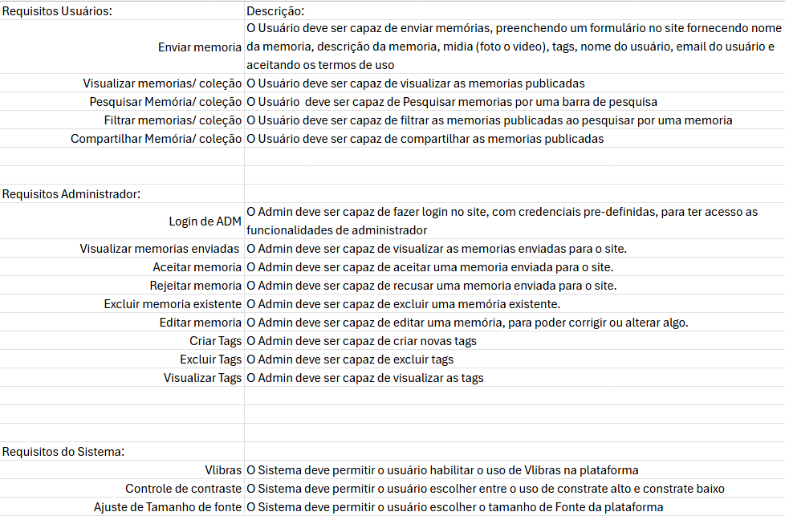
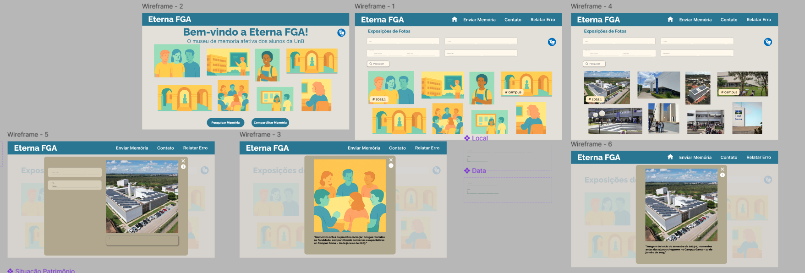

# 2.5. Iniciativas Extras (Modelagem)

Breve relato sobre as Iniciativas Extras realizadas pela equipe, no escopo da entrega.

Apresentar links para comprobatórios que evidenciem qualquer que seja a realização extra conferida pela equipe no escopo da entrega.

## Requisitos do Eterna FGA

Requisitos que o time elicitou, durante a [segunda reunião](../Atas/ata_reuniao2.md).  

## 

  
<strong>Autores:</strong> Todos os membros da equipe

## Protótipo de Alta Fidelidade

Atualização do Protótipo de média Fidelidade para um de alta fidelidade e interativo 
## 
[Acesse o protótipo](https://www.figma.com/proto/BpaXMm1LCLoZntohEHg65Q/Prot%C3%B3tipo-Eterna-FGA?node-id=3-30&t=OHQqMZTR3pjp8WwT-1&scaling=min-zoom&content-scaling=fixed&page-id=0%3A1&starting-point-node-id=3%3A30&show-proto-sidebar=1)

## Histórico de Versão

| Versão | Data | Descrição | Autor(es) | Revisor(es) | Comentário do Revisor |
| :-: | :-: | :-: | :-: | :-: | :-: |
| `1.0` | 07/05/2025  | Adiciona uma imagem dos requisitos | Cairo | | |
| `2.0` | 07/05/2025  | Adiciona o link do protótipo | Maria Eduarda | | |